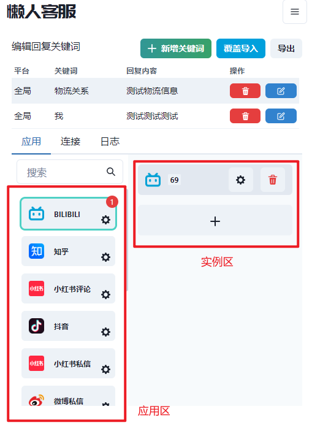
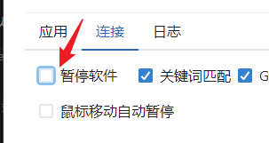
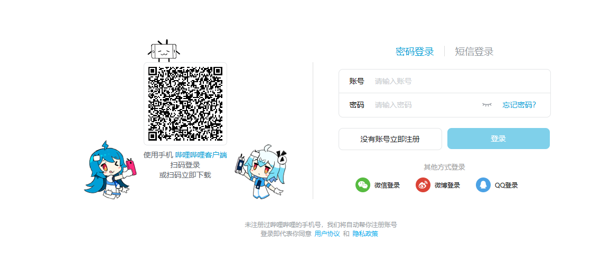
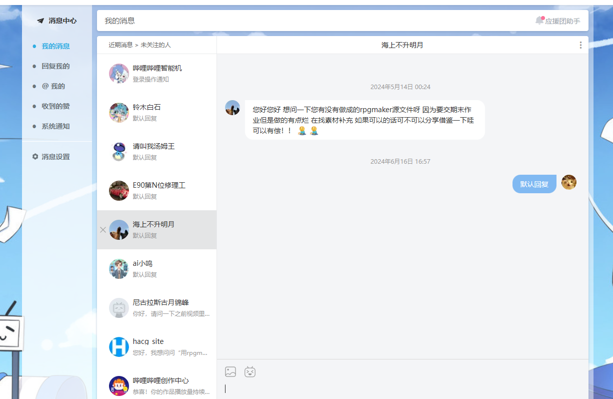
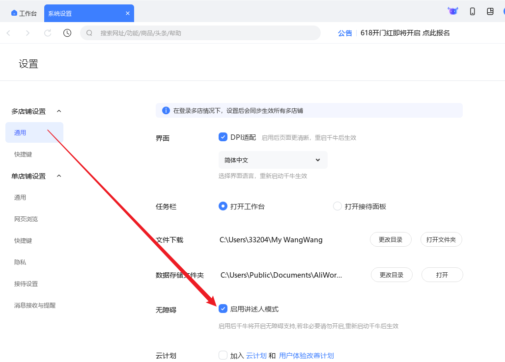
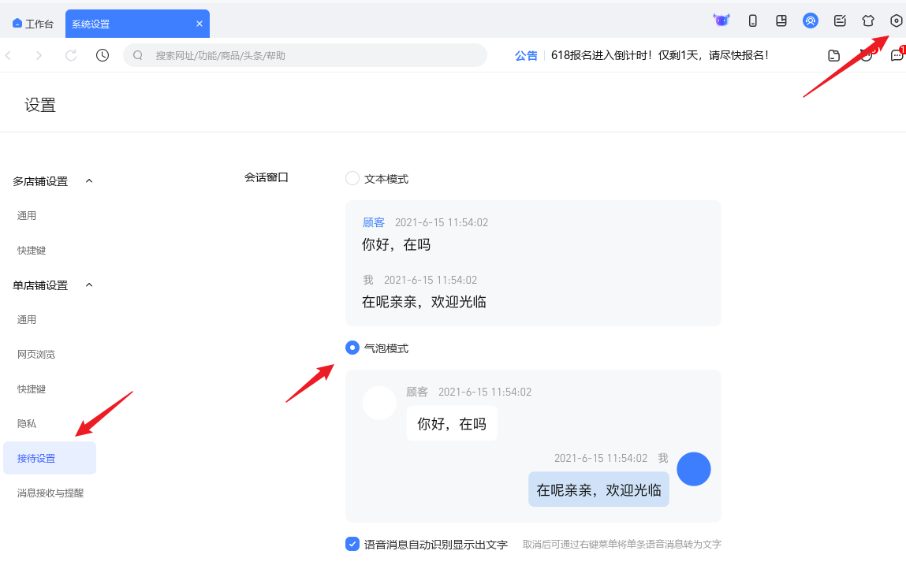
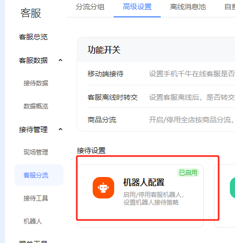
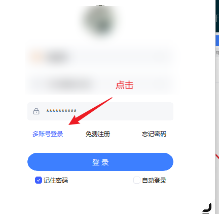
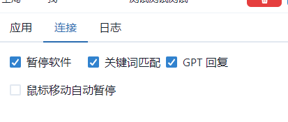

# 应用设置

我们进入首页可以看到一个应用列表，这里我们可以看到我们的应用列表，点击进入我们的应用

然后右边的面板可以创建多个实例，我们可以点击创建一个实例，然后记得取消勾选 “暂停软件”

## Web 端应用
如果是涉及到 Web 端的应用，需要根据提示下载 [Chrome](https://www.google.cn/chrome/) 浏览器。

下载安装最好安装到默认路径，否则有可能无法识别到 Chrome 的路径。

启动应用后，请自行在浏览器上登录您的账号

登录后它就会自动开始执行客服任务了

如果老是启动浏览器失败，可以尝试更新一下 Chrome 浏览器，有可能是版本太旧了，请到 [Chrome 官网](https://www.google.cn/chrome/) 下载最新版本的 Chrome 浏览器

## 千牛设置
首先到设置里面打开讲述人模式

再设置为气泡模式

然后记得关闭千牛的自动回复功能，否则会影响 ChatGPT 的回复

最后重启千牛，并在登录时选择多店铺模式进入

注意：如果回复太慢有可能是您的 GPT 太慢了，导致回复也很慢，可以先关掉 GPT，然后打开关键词回复试试，如果能正常回复了，说明不是懒人客服的问题。 

## 自动暂停设置
有时候我们需要暂停软件，可以在右边的面板中点击 “暂停软件” 按钮，然后软件就会暂停了

如果您希望能配合人工客服使用，可以把这个 “鼠标移动自动暂停” 勾上，它会在检测到鼠标移动时自动暂停软件，以避免影响人工客服的使用