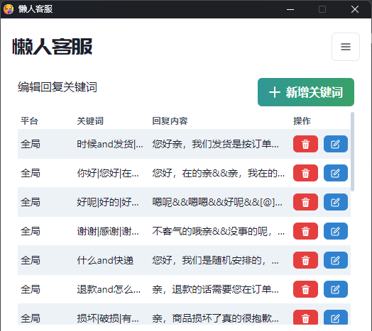
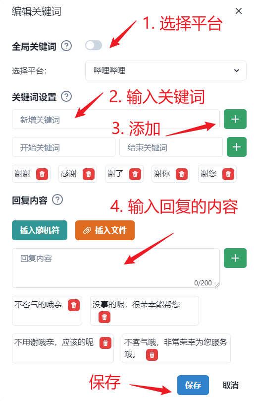

# 关键词编写

## 匹配关键词
当“开启关键词匹配”勾选后，会优先匹配这里设置的关键词。如果匹配到了关键词，就会回复关键词的回复内容。当没有匹配上关键词的问题，则会调用你提供的 ChatGPT API 去询问 GPT 回答用户问题。

点击“新增关键词”按钮可以自定义关键词和回复内容。

可以添加若干个用于匹配的关键词。

**关键词的编写规则**
- `你好`：只要用户输入的内容为 `你好` 时则会回复你设置的回复内容。
- `你好*`：模糊匹配使用 `*` 符号，例如 `你好*`，那么只要用户输入的内容以 `你好` 开头就会回复你设置的回复内容。
- `*你好*`：设置的关键词为`*你好*`，那么只要用户输入的内容中包含`你好`就会回复你设置的回复内容。

**比较特殊的**：如果使用 “开始关键词” 和 “结束关键词” 时，那么只要用户输入的内容以“开始关键词”开头，并且以“结束关键词”结尾，就能匹配上你设置的关键词。

## 回复的编写

- `关键词规则`：可以对应多条回复内容，当匹配到关键词时，会随机选择一条作为回复内容。
- `插入随机符：` 是因为在拼多多等平台，不允许每次重复一个回答，所以可以插入一个随机符，以规避这个问题。
- `插入文件：` 则主要用于插入图片，可以插入图片的链接，这样就可以回复图片了。

