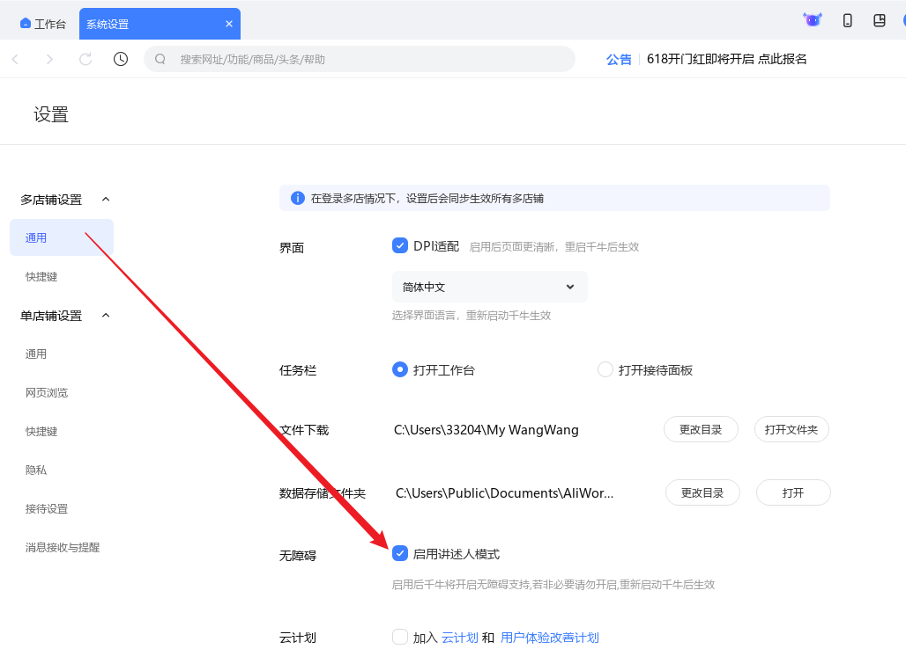

# 平台设置

## 基础设置
有时候，我们可能需要针对不同的平台设置不同的 ChatGPT API 地址，这时候就可以在这里设置。你可以基于 FastGPT/Dify 之类的工具实现自己的知识库，然后设置到这里。

当设置了平台单独的 ChatGPT API 地址后，就会优先使用这个地址去调用 ChatGPT API，如果没有设置，则会使用上面设置的全局 ChatGPT API 地址。

## 千牛设置
首先到设置里面打开讲述人模式

然后重启千牛，并在登录时选择多店铺模式进入

然后记得关闭千牛的自动回复功能，否则会影响 ChatGPT 的回复

