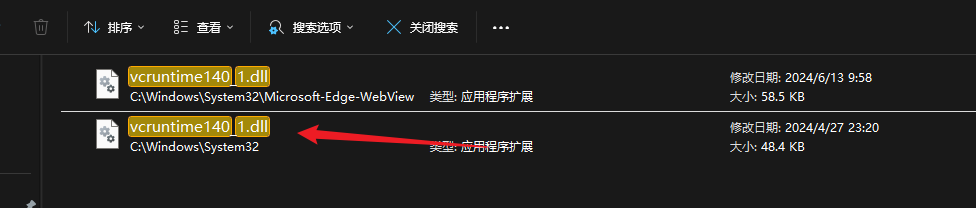
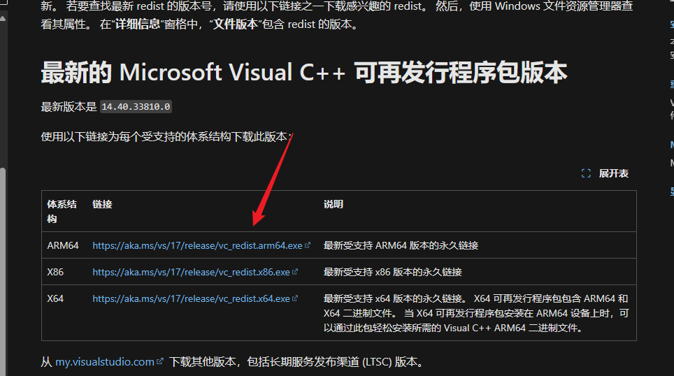

# 常见问题

### 1. 启动后无法看到应用列表
首先检查一下 C:\Windows\System32 目录下是否有这个 `vcruntime140_1.dll` 文件

如果没有这个文件，你需要在 [微软官网](https://learn.microsoft.com/zh-cn/cpp/windows/latest-supported-vc-redist?view=msvc-170) 下载并安装 Visual C++ Redistributable for Visual Studio 2015, 2017 and 2019

找到对应的版本下载安装即可，如果你的 Windows 是 64 位的，那么你需要下载安装 x64 版本的，如果是 32 位的，那么你需要下载安装 x86 版本的，如果是 AMD 的 CPU，那么你需要下载安装 ARM64 版本的

