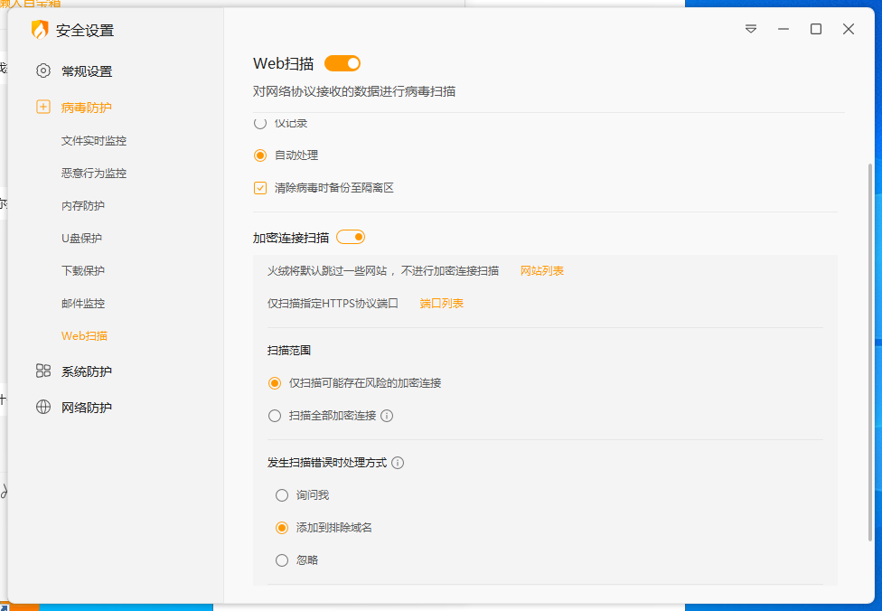

# 配置设置

## 配置类型

### 通用设置

* **提取信息**：勾选提取手机号或者提取咨询商品名后，它会去提取用户消息中的手机号或者商品名，然后将它存储到下面的路径中。

* **默认回复**：设置了默认回复后，当没有匹配到关键词时，或者报错时，会回复这个默认回复。

* **等待回复时间**：当用户发送消息后，会等待这么长时间后再回复用户，如果希望马上回复，可以将这个值设置成零。

* **上下文消息数**：当前使用 ChatGPT API 时，会将指定数量的聊天上下文，拿去调用 ChatGPT API，以便 ChatGPT API 更好的理解用户的问题。注意，这个值设置的越大，调用 ChatGPT API 的速度就会越慢。

* **等待人工间隔**：当遇到 ChatGPT 阻塞的时候，会等待这么长时间然后终止客服自动任务，转交给人工客服手动处理。

### AI 配置
* **选择 AI 服务商**：目前支持的 AI 服务商有：OpenAI、文心大模型、Gemini、腾讯混元、通义千问、Dify AI 以及 FastGPT

* 添加您使用的模型：这里需要填写您的 API 地址和 Key，以及模型的名称，然后点击添加即可。 这里的 Gpt 地址和 Key，你可以自己去找国内带知识库的代理去处理，本项目不提供任何 Gpt 服务。

* **检查连接**：点击检查连接按钮，可以检查当前设置的 ChatGPT API 地址是否能正常连接。注意这里报错了，请自行检查 ChatGPT API 地址是否正确，一般不关懒人客服的事情。

值得注意，6.0的火绒更新了一个功能，他会扫描加密流量，可能会导致你的 ChatGPT API 地址被拦截，所以请注意检查你的火绒设置，如果被拦截了记得要放行（或者直接关闭 web 扫描）。

### 插件配置

* 配置测试用例：填写用于测试插件的例子

### 全局配置

