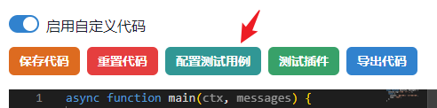
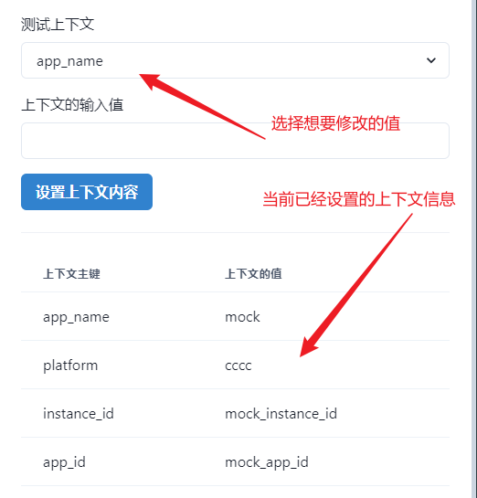
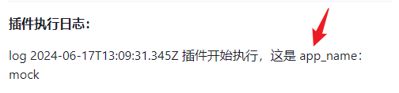

# 各个平台的上下文信息
目前懒人客服会在插件中传递一些上下文信息，用来区分应用以及会话信息，这里我们来简单的介绍下各个参数的含义：

```js
// 固定会传递的上下文参数，用来区分应用以及会话信息
export const CTX_APP_NAME = 'app_name';
export const CTX_APP_ID = 'app_id';
export const CTX_INSTANCE_ID = 'instance_id';

export const CTX_USERNAME = 'username'; // 当前操作的用户名
export const CTX_PLATFORM = 'platform'; // 当前所在平台
export const CTX_HAS_NEW_MESSAGE = 'has_new_message'; // 是否有新消息
export const CTX_HAS_GROUP_MESSAGE = 'has_group_message'; // 是否有群消息

// 电商平台（激活后才会返回）
export const CTX_CURRENT_GOODS = 'CTX_CURRENT_GOODS'; // 当前商品
export const CTX_CURRENT_GOODS_ID = 'CTX_CURRENT_GOODS_ID'; // 当前商品 ID
export const CTX_MEMBER_TAG = 'CTX_MEMBER_TAG'; // 会员标签
export const CTX_FAN_TAG = 'CTX_FAN_TAG'; // 粉丝标签
export const CTX_NEW_CUSTOMER_TAG = 'CTX_NEW_CUSTOMER_TAG'; // 新客标签
```


如果要使用这些上下文信息，只需要在插件中使用 `ctx.get('key')` 即可。



如果想要调试插件的上下文，可以点开 “配置测试用例” 然后在 “上下文信息” 中填写对应的上下文信息，然后点击 “测试” 按钮即可。



我们可以测试一下插件，这里我们使用一个简单的插件：

```js
async function main(ctx, messages) {
  console.log('插件开始执行，这是 app_name：', ctx.get('app_name'));

  return {
    content: '你好这是一个测试插件',
    type: 'TEXT',
  };
}
```

可以看到我们在插件中打印了 `app_name` 的值。



