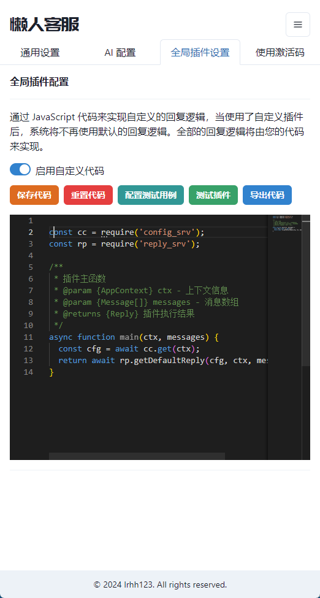

# 插件的编写
懒人百宝箱的插件是使用 javascript 编写的，插件的主要功能是处理用户的消息，然后返回一个回复。

```js
const cc = require('config_srv');
const rp = require('reply_srv');

/**
 * 插件主函数
 * @param {AppContext} ctx - 上下文信息
 * @param {Message[]} messages - 消息数组
 * @returns {Reply} 插件执行结果
 */
async function main(ctx, messages) {
  const cfg = await cc.get(ctx);
  return await rp.getDefaultReply(cfg, ctx, messages);
}
```

我们这里来简单的介绍下各个参数的含义：

* `AppContext`：上下文信息，包含了当前用户的信息，当前插件的信息等
* `Message[]`：消息数组，包含了用户发送的消息

### 上下文信息
这个上下文的结构是一个 Map

```typescript
export type Context = Map<string, string>;
```

所以如果想要取得什么信息只需要

```js
const val = ctx.get('key');
```

即可，这里的 key 是一些预定义的 key：

```js
// 固定会传递的上下文参数，用来区分应用以及会话信息
export const CTX_APP_NAME = 'app_name';
export const CTX_APP_ID = 'app_id';
export const CTX_INSTANCE_ID = 'instance_id';

export const CTX_USERNAME = 'username'; // 当前操作的用户名
export const CTX_PLATFORM = 'platform'; // 当前所在平台
export const CTX_HAS_NEW_MESSAGE = 'has_new_message'; // 是否有新消息
export const CTX_HAS_GROUP_MESSAGE = 'has_group_message'; // 是否有群消息

// 电商平台（激活后才会返回）
export const CTX_CURRENT_GOODS = 'CTX_CURRENT_GOODS'; // 当前商品
export const CTX_CURRENT_GOODS_ID = 'CTX_CURRENT_GOODS_ID'; // 当前商品 ID
export const CTX_MEMBER_TAG = 'CTX_MEMBER_TAG'; // 会员标签
export const CTX_FAN_TAG = 'CTX_FAN_TAG'; // 粉丝标签
export const CTX_NEW_CUSTOMER_TAG = 'CTX_NEW_CUSTOMER_TAG'; // 新客标签
```

例如当我们需要获取应用 id 时，可以通过 `ctx.get('app_id')` 来获取。


### 消息数组
这个消息的结构是一个数组，数组中的每个元素都是一个消息对象，消息对象的结构如下：

```typescript
export type RoleType = 'SELF' | 'OTHER' | 'SYSTEM';
export type MessageType = 'TEXT' | 'IMAGE' | 'VIDEO' | 'FILE';

export interface Message {
  sender: string; // 发送者的用户名，注意有些平台可能没有这个信息
  content: string; // 消息内容
  role: RoleType; // 发送者的角色
  type: MessageType; // 消息类型
}
```

一般我们只需处理 OTHER 类型的消息即可，因为这是用户发送的消息。SELF 类型的消息是自己发送的消息，SYSTEM 类型的消息是系统消息，一般不需要处理。

例如我们只需要处理文本消息，可以通过 `messages.filter(m => m.type === 'TEXT')` 来获取。

例如：

```js
async function main(ctx, messages) {
  lastMessage = messages.filter(m => m.type === 'TEXT').pop();

  // ...
}
```

### 回复消息
上面介绍了插件的输入，下面我们来介绍插件的输出，即回复消息。

```typescript
export interface ReplyDTO {
  content: string;
  type: MessageType;
}
```


回复时只需要返回这个对象即可，例如：

```js
async function main(ctx, messages) {
  return {
    content: '你好',
    type: 'TEXT',
  };
}
```

那么这个插件就会回复用户 `你好` 这个消息。当然你可以按你的需求来做更复杂的需求，例如我们改造一下标准的插件：

```js
const cc = require('config_srv');
const rp = require('reply_srv');

async function main(ctx, messages) {
  const cfg = await cc.get(ctx);
  const reply = await rp.getDefaultReply(cfg, ctx, messages);

  // 我们替换一下 reply 的 '你好' 为 '您好'
  reply.content = reply.content.replace('你好', '您好');
  return reply;
}
```

### 调试插件
好了，我们已经介绍了插件的编写，下面我们来介绍一下如何调试插件。



首先我们进入到这个设置页面，然后打开 “启用自定义插件” 这个开关，然后我们可以在这个页面看到一个编辑器，再在上面输入我们的插件代码，然后点击保存即可。

```js
async function main(ctx, messages) {
  return {
    content: '你好这是一个测试插件',
    type: 'TEXT',
  };
}
```

再点击 “测试插件” 按钮，我们就可以看到插件的执行结果了。


可以看到上面已经展示了插件的执行结果，这样我们就可以很方便的调试插件了。

### 打印日志
有时候我们需要打印一些日志来调试插件，这时候我们可以使用 `console.log` 来打印日志，这些日志会在控制台中显示。

```js
async function main(ctx, messages) {
  console.log('插件开始执行');
  return {
    content: '你好这是一个测试插件',
    type: 'TEXT',
  };
}
```


即可在控制台中看到这个日志。